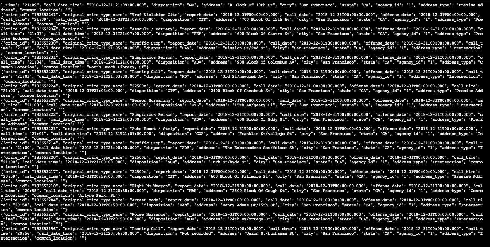
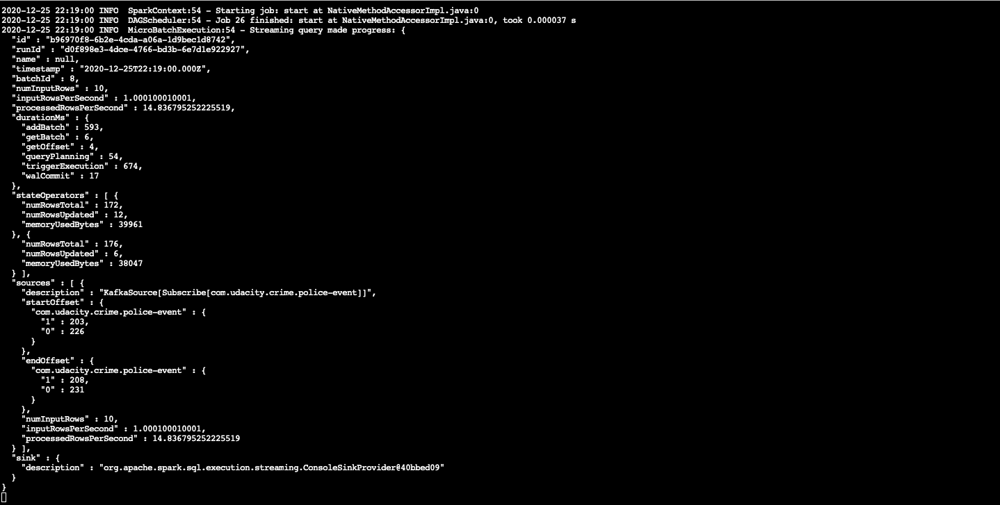
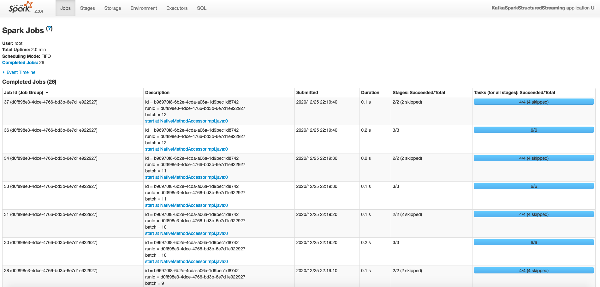

## SF Crime Incident Analysis

#### File Information
* snapshots.zip contains the snapshots.
* producer_server.py
* data_stream.py
* kafka_server.py

#### Q1. How did changing values on the SparkSession property parameters affect the throughput and latency of the data?
* Altering the number of rows processed (processedRowsPerSecond/inputRowsPerSecond) has a direct impact on the throughput and latency of the data.

#### Q2. What were the 2-3 most efficient SparkSession property key/value pairs? Through testing multiple variations on values, how can you tell these were the most optimal?
* Experimented with spark.sql.shuffle.partitions value from 2 to 20 and found processedRowsPerSecond to be better at 2.
* Experimented with spark.default.parallelism value and found that processedRowsPerSecond was better at smaller values.

##### Kafka Consumer Console Output

##### Spark Job Progress Report

##### Spark Streaming UI Snapshot
